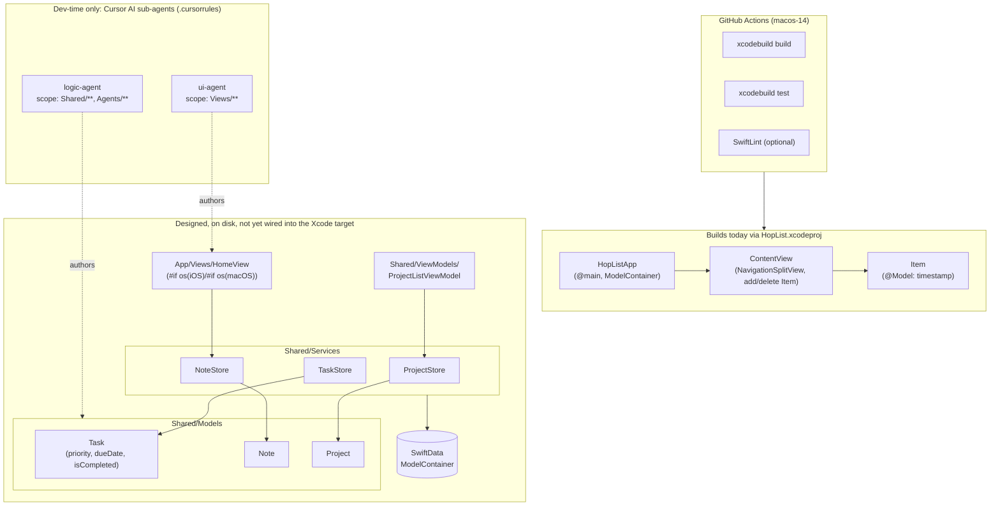

# HopList (macOS-first)

**A SwiftUI + SwiftData task/note/project manager for macOS, built with a shared-first architecture designed for a future iOS target — and developed using Cursor AI sub-agents with defined scopes and responsibilities.**

## Why

HopList is a personal project exploring two things at once: (1) a "shared-first" SwiftUI/SwiftData architecture where business logic (models, stores, view models) lives in a platform-agnostic layer that both a macOS and a future iOS app can consume, and (2) an AI-assisted development workflow using Cursor's agent configuration (`.cursorrules`) to split work across specialized sub-agents (UI, logic/data, testing) with explicit file scopes.

## Honest Project Status

This repository is **early-stage / architecture-scaffold**, and this README is deliberately upfront about the gap between the designed architecture and what currently builds:

- **What actually builds today:** the `HopList.xcodeproj` project (via its `HopList`, `HopListTests`, `HopListUITests` targets) currently compiles the stock Xcode "macOS App + SwiftData" template — a single `Item` model with a timestamp, listed in a `NavigationSplitView`. This is the buildable, CI-verified surface of the repo right now.
- **What's designed but not yet wired in:** a substantially more developed "shared-first" layer exists on disk — `Shared/Models` (`Task`, `Note`, `Project`), `Shared/Services` (`TaskStore`, `NoteStore`, `ProjectStore`), `Shared/ViewModels` (`ProjectListViewModel`), and `App/Views/HomeView.swift` (a platform-branching `#if os(iOS)/#if os(macOS)` view). These files are real, non-trivial Swift (SwiftData models, `ObservableObject` stores, protocol-based DI) but are **not** part of `HopList.xcodeproj`'s synchronized source groups, so they don't currently compile as part of the app target. `iOS/` and `macOS/` platform folders exist only as empty scaffolding.
- **Background agents (`docs/BACKGROUND_AGENTS.md`):** describes a planned `BackgroundAgent` protocol / `AgentManager` / `BGTaskScheduler`-based sync system. No `HopList/Agents/` implementation exists yet — this is a design document, not a shipped feature.
- **`.cursorrules` / `.cursorrules-alternative` / `docs/AGENT_TASK_MANAGEMENT.md`:** these configure **Cursor's AI coding sub-agents** (`ui-agent`, `logic-agent`, etc.) used during *development* of this repo — they are not an in-app runtime feature. Worth including in a portfolio as an example of a structured AI-assisted workflow, but distinct from "background agents" as an app capability.

In short: read this repo as a well-documented in-progress rebuild, not a finished product. The CI in `.github/workflows/ci.yml` reflects the current minimal target, not the full designed architecture.

## Key Features (of the designed architecture)

- **Task management** — title, description, priority (`low`/`medium`/`high`/`urgent`), due date, completion state, overdue/days-until-due computed properties (`Shared/Models/Task.swift`)
- **Notes and projects** as first-class SwiftData models (`Shared/Models/Note.swift`, `Shared/Models/Project.swift`)
- **Protocol-based stores** (`NoteStore`, `TaskStore`, `ProjectStore`) for dependency injection and testability, each with an `ObservableObject` conformance and async CRUD methods
- **Platform-branching SwiftUI view** (`HomeView`) that renders a `NavigationView`-based layout on iOS and is intended to grow a macOS-specific layout, from one shared view model
- **Currently-shipping app:** a minimal macOS SwiftData list (add/delete timestamped items) — the honest baseline this repo builds from

## Architecture



## Tech Stack

- **SwiftUI** — all UI, `NavigationSplitView` (macOS) / `NavigationView` (iOS, designed)
- **SwiftData** — `@Model` persistence for `Item` (shipping) and `Task`/`Note`/`Project` (designed)
- **XCTest** + Swift Testing (`import Testing`) — mixed across test targets
- **GitHub Actions** — CI on `macos-14` runners (`.github/workflows/ci.yml`): build + test the `HopList` scheme, plus an optional SwiftLint step
- No third-party package dependencies

## Project Structure

```
HopList/
├── HopList/              # Buildable app target (HopListApp.swift, ContentView.swift, Item.swift)
├── HopListTests/         # Unit tests for the buildable target
├── HopListUITests/       # UI tests for the buildable target
├── HopList.xcodeproj/    # Xcode project (only HopList/*Tests/*UITests are synchronized targets)
├── Shared/               # Designed shared-first layer: Models, Services, ViewModels (not yet in the Xcode target)
├── App/Views/             # Designed cross-platform views (HomeView.swift)
├── iOS/, macOS/           # Empty platform-specific scaffolding for future expansion
├── Tests/, UITests/       # Additional test scaffolding for the Shared layer
├── HoplistMacTests/, HoplistMacUITests/  # Stub test targets from an earlier target-naming pass
├── docs/                  # Architecture and background-agent design docs
├── .cursorrules, .cursorrules-alternative  # Cursor AI dev sub-agent configuration
└── .github/workflows/ci.yml  # CI: build + test + optional lint
```

## Setup / Running

Requirements:

- Xcode 16.0 or newer
- macOS 14.0+ deployment target

```sh
open HopList.xcodeproj
```

Select the `HopList` scheme and run (⌘R). No special entitlements or capabilities are required for the current buildable target. If you want to explore the designed `Shared`/`App` architecture, it currently needs to be added to the Xcode project's synchronized groups (or converted into a local Swift package) before it will compile — it is not part of the build today.

### CI

`.github/workflows/ci.yml` runs on `macos-14` and does:

```sh
xcodebuild -project HopList.xcodeproj -scheme HopList -destination 'platform=macOS' build
xcodebuild -project HopList.xcodeproj -scheme HopList -destination 'platform=macOS' test
```

plus an optional SwiftLint pass.

## License

MIT — see [LICENSE](LICENSE).
